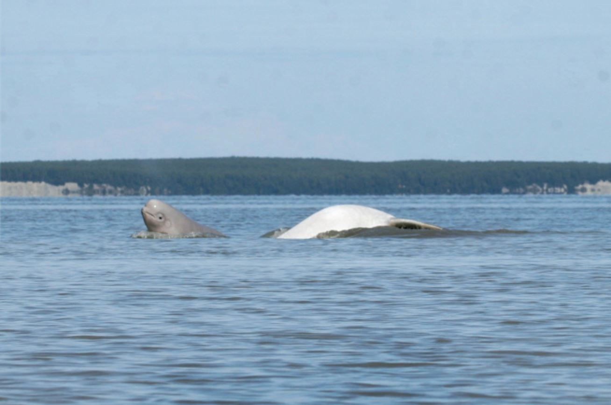

Photo: Chris Garner, Joint Base Elmendorf–Richardson

# Introduction

In the U.S., there are five populations of beluga whales, all in Alaska. Of those five, the Cook Inlet population is the smallest and has declined by about seventy-five percent since 1979. This population was listed as endangered in 2008, with hopes that the population would begin to recover in the near future, but more than a decade later they continue to decline, with a current population estimate of 279 whales (as of January 2020). Read more detailed stories about Cook Inlet beluga whales [here](https://www.fisheries.noaa.gov/video/species-spotlight-cook-inlet-beluga-whale).

Scientists working to understand and protect belugas rely on acoustic recordings to study populations and behavior, but reviewing these recordings to find beluga sounds is time-consuming, and creates a substantial demand on limited conservation resources.  The goal of this project is to build a machine learning model that automatically detects and classifies beluga whale acoustic signals, reducing the time required to annotate data and answer key conservation questions. More specifically, the NOAA team has historically used a whale detector that is sensitive but not specific (i.e., it rarely misses whales but generates numerous false positives); the goal of this project is to provide a more robust detector to eliminate the time spent reviewing false positives.

This project is collaborative work among the [AI for Earth](https://aka.ms/aiforearth) team at Microsoft, the [AI for Good Research Lab](http://aka.ms/aiforgood) at Microsoft, and the NOAA (National Oceanographic and Atmospheric Administration) [Alaska Fisheries Science Center](https://www.fisheries.noaa.gov/about/alaska-fisheries-science-center). 

# Data

The data was collected with hydrophones (i.e., underwater microphones) placed in permanent moorings within the Cook Inlet beluga whale critical habitat. The datasets included in this study correspond to five- to seven-month mooring deployments for the ice-free water season (May to September) or winter season (October to April) in 2017-2018 in seven locations, which account for more than 13,000 hours of audio recordings. The NOAA team ran all of these audio recordings through the preliminary detector that they have used throughout this project, and the results were manually validated by an expert reviewer.  Every detection was labeled as either a true detection (i.e., with beluga whale calls) or a false detection (i.e., without beluga whale calls). This labeled dataset served as training and test data for our machine learning work.

# Methodology

We extracted spectrograms for each detection, and use them along with the associated labels (whale/non-whale) as the input to a binary classification model. Four deep learning CNN models were trained (see below); the final detector is an ensemble of these four models.

* Model 1: Built a CNN from scratch using AlexNet architecture.
* Model 2: Transfer learning with fine-tuning from a pre-trained VGG16 model.
* Model 3: Transfer learning with fine-tuning from a pre-trained ResNet50 model.
* Model 4: Transfer learning with fine-tuning from a pre-trained DenseNet model.

# Running the scripts

There are six Python scripts which are named sequentially (from step1 to step6), from extracting spectrograms to training individual CNN models and the ensemble.

# Publication
Zhong, Castellote, Dodhia, Lavista Ferrer, Keogh, Brewer. In Press. Beluga Whale Acoustic Signal Classification using Deep Learning  Neural Network Models. Journal of the Acoustical Society of America.

# Contributing

This project welcomes contributions and suggestions.  Most contributions require you to agree to a
Contributor License Agreement (CLA) declaring that you have the right to, and actually do, grant us
the rights to use your contribution. For details, visit https://cla.opensource.microsoft.com.

When you submit a pull request, a CLA bot will automatically determine whether you need to provide
a CLA and decorate the PR appropriately (e.g., status check, comment). Simply follow the instructions
provided by the bot. You will only need to do this once across all repos using our CLA.

This project has adopted the [Microsoft Open Source Code of Conduct](https://opensource.microsoft.com/codeofconduct/).
For more information see the [Code of Conduct FAQ](https://opensource.microsoft.com/codeofconduct/faq/) or
contact [opencode@microsoft.com](mailto:opencode@microsoft.com) with any additional questions or comments.
